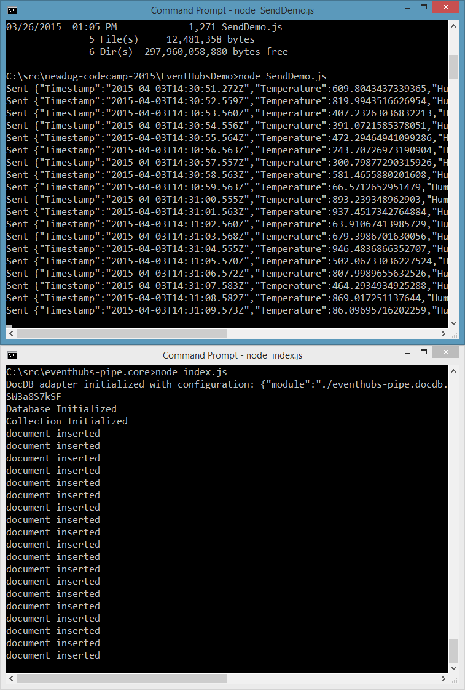

# eventhubs-pipe.core
Node.js tools for piping data from event hubs to output adapters

Data is read from [Event Hubs](http://azure.microsoft.com/en-us/services/event-hubs/), and then output to an output adapter. A console output adapter is provided as a sample, as well as an adapter to insert records into [DocumentDB](http://azure.microsoft.com/en-us/services/documentdb/).

**This is not remotely ready for production use.** Faults are not currently handled, and there is no rate matching between Event Hubs and DocumentDB. Also, the way ID's are generated is temporary.

This wouldn't be possible without the [AMQP Node.js library](https://github.com/noodlefrenzy/node-amqp10) from [Michael Lanzetta](https://github.com/noodlefrenzy).

# License

Microsoft Developer Experience & Evangelism

Copyright (c) Microsoft Corporation. All rights reserved.

THIS CODE AND INFORMATION ARE PROVIDED "AS IS" WITHOUT WARRANTY OF ANY KIND, EITHER EXPRESSED OR IMPLIED, INCLUDING BUT NOT LIMITED TO THE IMPLIED WARRANTIES OF MERCHANTABILITY AND/OR FITNESS FOR A PARTICULAR PURPOSE.

The example companies, organizations, products, domain names, e-mail addresses, logos, people, places, and events depicted herein are fictitious. No association with any real company, organization, product, domain name, email address, logo, person, places, or events is intended or should be inferred.